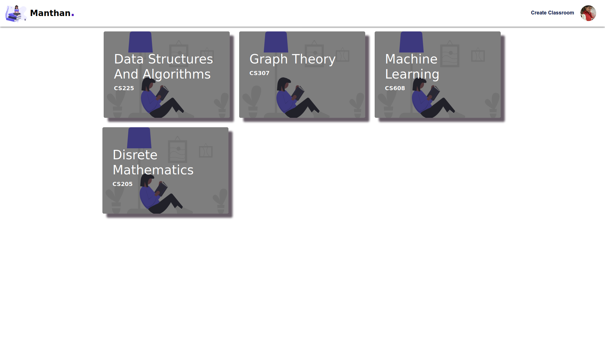
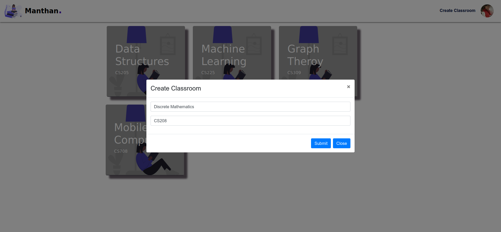
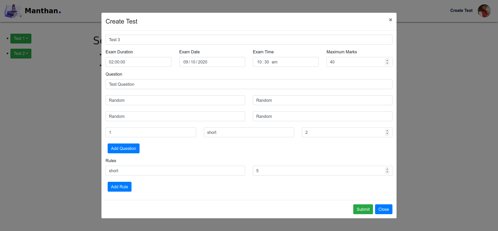
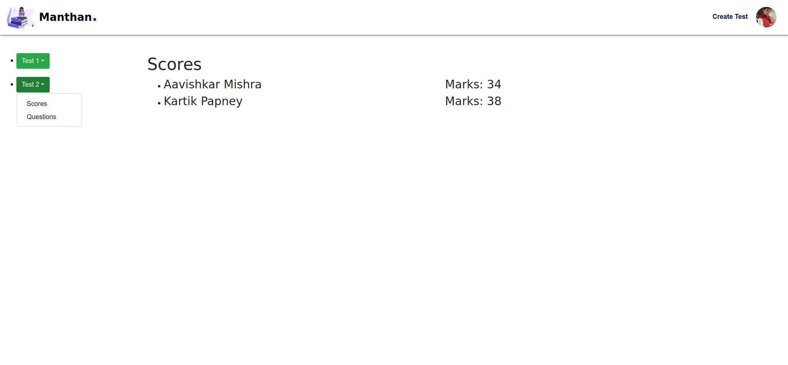
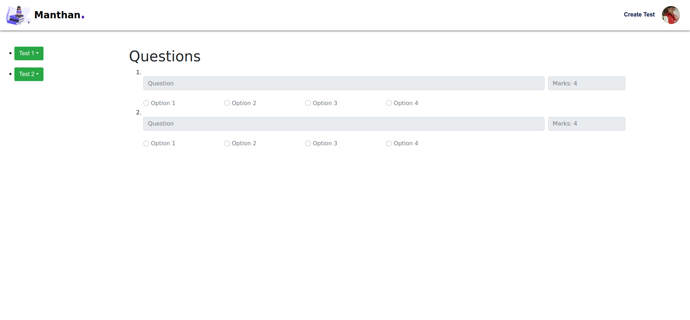
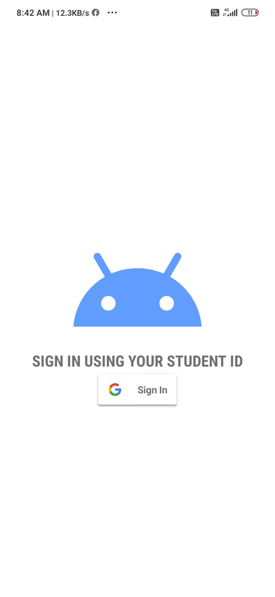
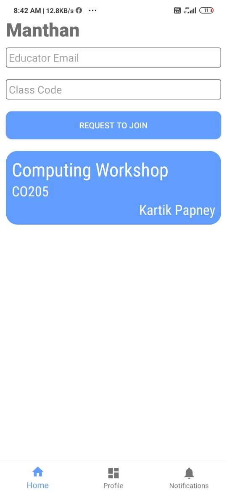
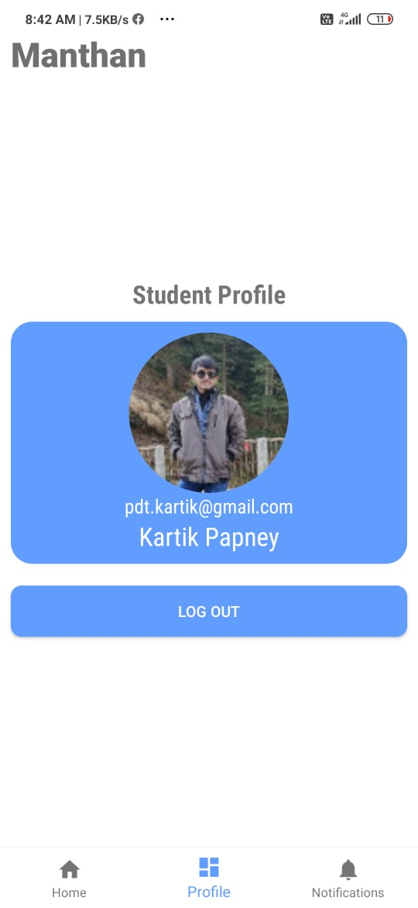
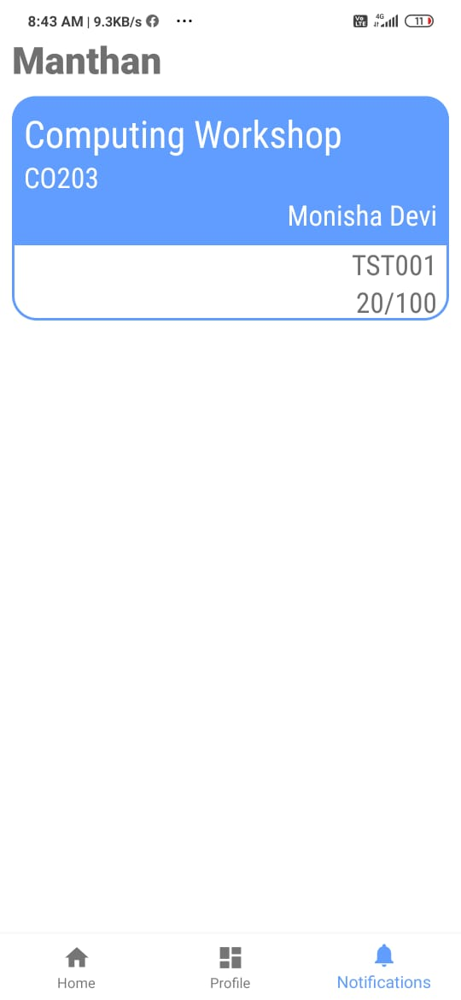

  
  <h1 align="center">MANTHAN</h1>
  <h3>उत्तिष्ठत जाग्रत प्राप्य वरान्निबोधत।</h3>

## Problem Statement
 - Provide a secure testing platform to Online Educators

## Idea
- We will provide an online android testing application which can be used to conduct tests wrapped with all necessary precautions so to reduce the chances of cheating. Here the educator will give some questions in his pannel(account) and all the questions will be randomly distributed among the students resulting in having infinite number of sets. And students have to attempt the test in their android device using Gmail ID's.

## Features
- A secure platform for online testing.
- Interactive and easy to use.
- Grades can be accessed/ changed even after the completion of test.
- Teacher can decide if a particular question is compulsary in all the tests or not.
- Application is in locked mode so no transition between whatsapp and application.
- A basic facility like calculator will be present in the application so to do basic math operations.
- A list of the marks will be sent to the educator just after the completion of the test.
- Will use Gmail or Student mail Id's to save student marks.
- Test will be automatically submitted after the time frame.
- We'll try to block incoming calls/ messages/ screen capture and all the unnecessary activities during the test.

## Technologies Used 
- ### Reactjs to develop admin pannel for educators
- ### Firestore 
- ### Java SDK to develop android application for students

## Live App 
[Android App for students and teachers]() and [Web app for teachers to add tests](https://manthan-app.herokuapp.com/).

## Installing on Local Host
- ### `git clone https://github.com/prasanjit101/manthan.git`
        Clone the git repository in your system.
- ### `npm install`
        Install required dependencies.
- ### `npm start`
        Runs the app in the development mode.
- ### Download app from [here]()
        Android app to give online tests.

## Screenshots
### Screenshot 1

### Screenshot 2

### Screenshot 3

### Screenshot 4

### Screenshot 5

## Android Screenshots
### Screenshot 1

### Screenshot 2

### Screenshot 3

### Screenshot 4

## Authors
- ### [Aavishkar Mishra](https://github.com/aavishkarmishra)
- ### [Kartik Papney](https://github.com/kartikpapney)
- ### [Prasanjit Dutta](https://github.com/prasanjit101)

